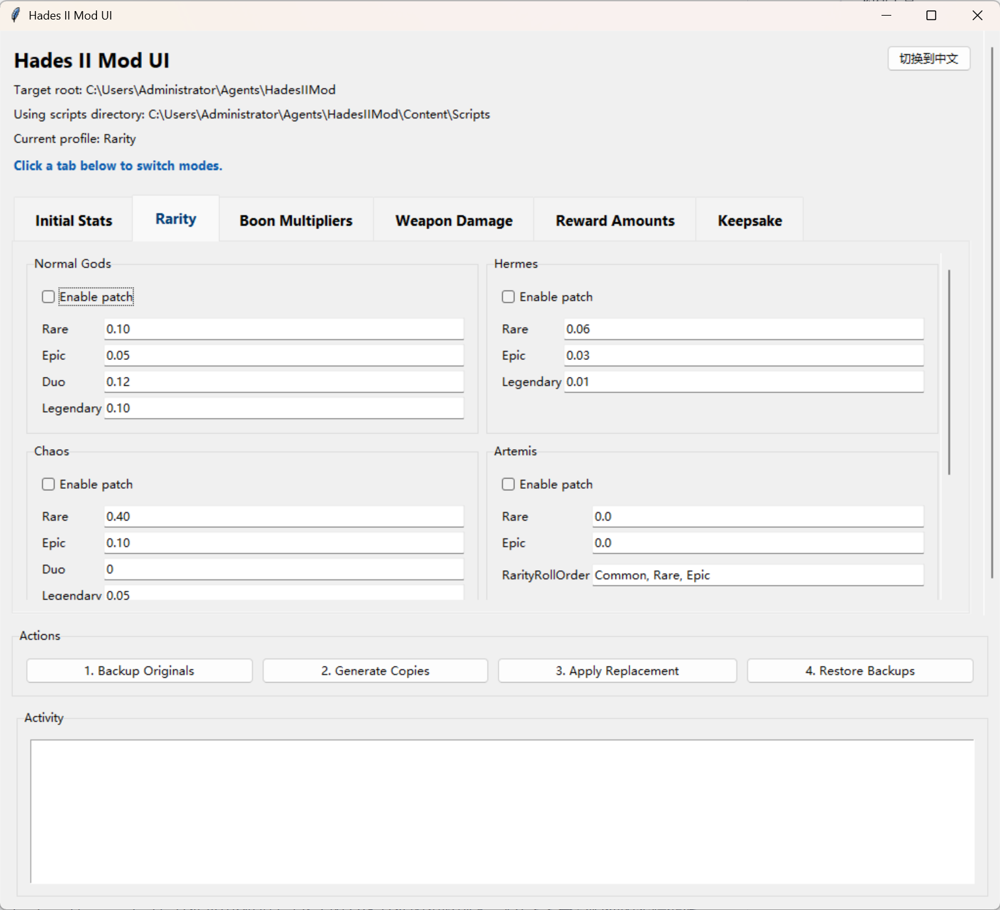

# Hades II Modifier

[中文](README_ZH.md)

For noob players like you and me, who suffer but are still eager to find a way to clear the game.

## Overview

The `HadesIIModUI` uses deterministic Lua text transforms to insert patches into the `Content/Scripts` folder. The application always ensures backups are made before applying changes and maintains state in a local `.hades2_mod` workspace.


## How to Use



The user interface is split into **Tabs (Modes)** for configuration, and an **Actions** panel for execution. 

###  File Path Setting

Put the exe to the main directory of `Hades II`.

###  Configure Patches
Select a tab at the top to switch between different modding modes. In each mode, you can toggle `Enable patch` to activate specific modifications:

- **Rarity Editor**: Adjust the spawn chances for Normal Gods, Hermes, Chaos, Artemis, and more. You can change the probabilities for Rare, Epic, Duo, and Legendary boons, as well as customize the roll order.
- **Boon Multipliers**: Fine-tune the stat multipliers (damage, speed, etc.) provided by specific boons from each god. Advanced fields are hidden by default but can be revealed for deeper customization.
- **Weapon Damage**: Add flat base-damage bonuses to entire weapon families.
- **Reward Amounts**: Edit the global post-combat room-clear payout values (e.g., Money, Health, Mana).
- **Keepsake**: Configure the per-keepsake buffs applied in `TraitData_Keepsake.lua`.

###  The Modding Workflow
Once your patches are configured, use the **Actions** buttons in the following order:

1. **1. Backup Originals**: Safely creates backups of the original, unmodded Lua scripts in the `.hades2_mod/originals/` folder. Always do this before applying your first patch!

2. **2. Generate Copies**: Click this first. It reads your current configurations and creates preview copies of the patched Lua files in the `.hades2_mod/generated/` folder. *This does not affect your live game yet.* You can verify the targeted files in the "Target Files" list.

3. **3. Apply Replacement**: The app automatically copies the generated patched files over to your live `Content/Scripts/` folder. Your game is now modded!

### Restoring the Game
If you want to revert your changes and return to the orginal game:
- **4. Restore Backups**: The app automatically replaces the modded files in `Content/Scripts/` with the original files safely kept in `.hades2_mod/originals/`.

## Build Locally

- Create virtual environment.
```bash
python -m venv .venv
```

- Activate virtual environment.
```bash
.venv\Scripts\activate
```

- Install dependencies.
```bash
pip install pyinstaller
```

- Build the executable.
```bash
./build.ps1
```

## Developer Notes

- The tool stores your UI settings and application state locally in `.hades2_mod/state.json`.
- Advanced AI agent guides and rules can be found in `AGENTS.md` and `CLAUDE.md`.

